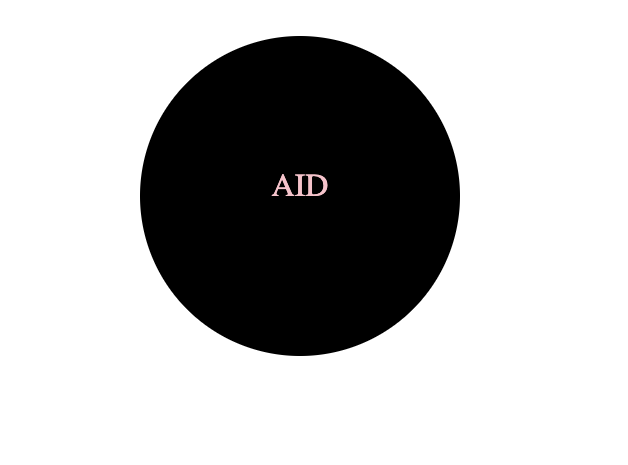

# SVGconvert

# Description
SVGConvert wil;l allow the user to create a logo using the command line. The user will be prompted to enter text, text color, and shape. The user will be able to choose from a circle, triangle, or square. The user will also be able to choose the color of the shape. Once the user has entered all the information, an SVG file will be created named logo.svg. The user will be able to open the logo.svg file in a browser and see the logo they created.

# User Story
* AS a freelance web developer
* I WANT to generate a simple logo for my projects
* SO THAT I don't have to pay a graphic designer

# Acceptance Criteria
* GIVEN a command-line application that accepts user input
* WHEN I am prompted for text
* THEN I can enter up to three characters
* WHEN I am prompted for the text color
* THEN I can enter a color keyword (OR a hexadecimal number)
* WHEN I am prompted for a shape
* THEN I am presented with a list of shapes to choose from: circle, triangle, and square
* WHEN I am prompted for the shape's color
* THEN I can enter a color keyword (OR a hexadecimal number)
* WHEN I have entered input for all the prompts
* THEN an SVG file is created named `logo.svg`
* AND the output text "Generated logo.svg" is printed in the command line
* WHEN I open the `logo.svg` file in a browser
* THEN I am shown a 300x200 pixel image that matches the criteria I entered

# Usage

# URL 
This link will demostrate the user on how to use the application.
 https://drive.google.com/file/d/1rleQN5rrQFA6XHlGZabIlxiUr_2_UpaI/view